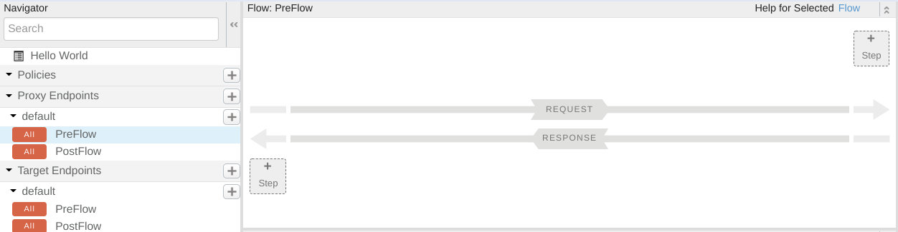
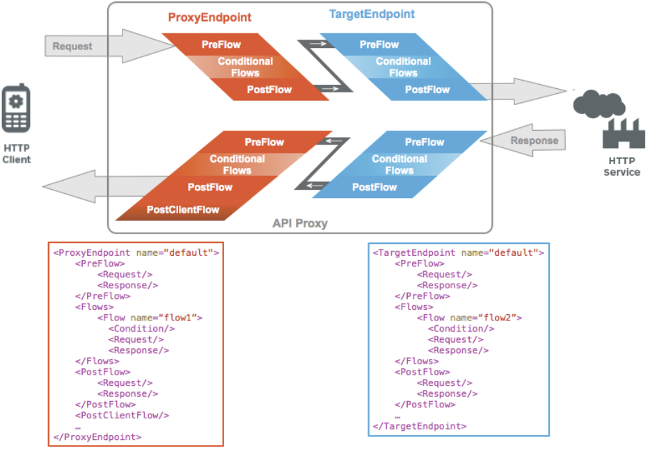
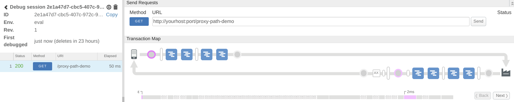

# proxy-path-demo
A simple demonstration of the path that a request takes as it works it's way through an Apigee proxy and eventually comes back as a response

## Intro
When I first started working with Apigee, the proxy flow wasn't immediately clear to me. I wasn't sure, for example, if the Proxy PostFlow request occured before the Target PreFlow request, or where the Target PostFlow Response happened in relation to the Proxy PreFlow request. In my opinion, the Apigee UI doesn't do a great job at displaying the flow of policies

When I looked at the documentation, I still had some trouble connecting the dots from it to the actual Apigee UI.

So I created myself a proxy much this like this to demo for myself the flow within a proxy. It's rather simple, but I hope you still find it insightful.

## Create & Deploy the Proxy

Download the proxy bundle zip file in this repository by clicking on the `proxy-path-demo.zip` file above. Then, click the "Download" button.

Navigate to your Apigee Org > Develop > API Proxies and click "Create Proxy". Choose the "Upload proxy bundle" option, upload the zip, and create the proxy. Now deploy your proxy.

## Test the Proxy & View Results

First, make sure that you know how to call your API. To find your Apigee domain, go to Admin > Environments > Groups. Note down your domain. Your proxy url should be https://{domain}/proxy-path-demo assuming that you didn't change your proxy path.

Navigate to the debug tab and start a debug session. Then, in your browser, navigagte to your proxy url. After doing so, come back to your Apigee tab and see the flow of policies

Now it's apparent, the flow is client > proxy preflow request -> proxy postflow request -> target preflow request -> target postflow request -> target -> target preflow response -> target postflow response -> proxy preflow response -> proxy postflow response.